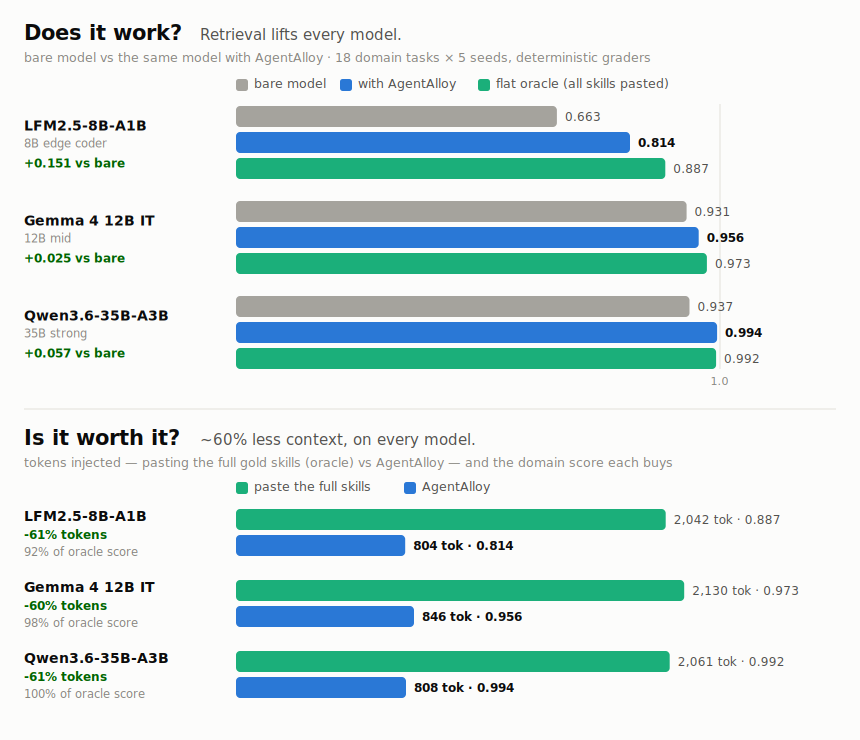

# Benchmarks

## Overview

AgentAlloy benchmarks are organized into 5 layers, each measuring a different
aspect of the system's effectiveness. Run all layers or pick individual ones:

```bash
uv run python -m eval.benchmark              # all layers
uv run python -m eval.benchmark --layer 1     # retrieval quality only
uv run python -m eval.benchmark --dry-run     # show what would run
```

### Layers

| Layer | Name | Needs agent model? | What it proves |
|-------|------|--------------------|----------------|
| 1 | Retrieval quality | No | Recall@k, precision@k, MRR, phase contamination |
| 2 | Composed vs flat | Yes | Token savings, quality parity, speed |
| 3 | Cross-model robustness | Yes | Quality generalizes across model sizes |
| 4 | Idempotency | No | Deterministic composition (same task -> same output) |
| 5 | Session simulation | No | Context-rot argument: flat degrades across phases |

The five layers above measure the **composition** path (task → skills). The
**signals / phase-gate layer** — which decides SDD phase transitions from user
intent — is benchmarked separately; see
[Intent Classification](#intent-classification-signals-layer).

---

## Composed vs Flat (Layer 2)

AgentAlloy's just-in-time composed injection is compared against flat skill
injection and a no-injection baseline. The pre-registered tasks and
deterministic binary graders live in `eval/tasks.py` (generic) and
`eval/domain_tasks.py` (domain); the harness is `eval/run_poc.py`.

The durable result lives in the **domain** set — convention-heavy tasks the
corpus actually carries knowledge for. The **generic** set is a near-ceiling
regression check (strong models need no help on general software tasks) and is
reported second, read accordingly.

Corpus provenance: the skill content in `src/agentalloy/_packs/` — especially
the domain packs — is distilled from vendor `llms.txt`/`llms.md` documentation
(Temporal, dbt, GitHub, etc.), not authored against these eval tasks. The tasks
and graders are in-house; the skill prose the retrieval pipeline selects from is
not.

### Domain tasks (v6.6.8 campaign, 2026-07-10)

The pre-registered domain set (`eval/domain_tasks.py`, 18 tasks × 5 seeded runs
per condition) targets pack conventions — webhook signature/dedup/DLQ handling,
Temporal determinism, GitHub Actions OIDC, dbt incremental models, SCD Type 2,
Redis streams/locks, Snowflake/Redshift, OTel trace propagation. Conditions:
**composed** (free-text `/compose`, `legs="domain"`, k=4 — the Tier-2
per-work-item shape the proxy ships), **composed-contract** (payload built by
`compose_request_from_contract` from per-task contract fixtures in
`eval/contracts/` — byte-equivalent to the proxy's contract-scoped Tier-2
branch, the product's centerpiece mode), **flat** (an *oracle* arm —
hand-injects exactly the task's gold skills, the ceiling automatic retrieval
chases), **none** (bare system prompt). Graders are deterministic binary
criteria, de-brittled in #141 to credit synonyms/paraphrase.

<picture>
  <source media="(prefers-color-scheme: dark)" srcset="docs/assets/benchmarks/layer2-domain-dark.svg">
  
</picture>

Serving config is the shipped v6.6.8 container: deterministic Stage-0
(`LM_ASSIST=off` on CPU), E7v2 aboutness-gated process demotion (`auto`
default — active exactly where Stage B arbitration is not), deepen-gate
`AGENTALLOY_DEEPEN_BAND=0.85` (a spare selection slot deepens the top skill
instead of adding a 4th sibling). Run manifests record service version, corpus
stamp, reasoning effort, and serving-backend identity; a gold-skill preflight
aborts the run if any task's gold skills are missing or deprecated.

| Model | None | Composed | Composed-contract | Flat (oracle) | Composed lift | % of oracle | Tokens vs flat |
|-------|------|----------|-------------------|---------------|---------------|-------------|----------------|
| Qwen3.6-35B-A3B | 0.937 | **0.994** | **0.995** | 0.992 | +0.057 | 104% | −61% |
| Gemma 4 12B IT | 0.931 | **0.956** | 0.950 | 0.973 | +0.025 | 59% | −60% |
| LFM2.5-8B-A1B (coder) | 0.663 | **0.814** | **0.837** | 0.887 | +0.151 | 67% | −60% |

Findings, stated as measured:

- **Composed beat the bare model on every architecture** (+0.025 to +0.151),
  and the weaker the model, the bigger the lift — on conventions a model
  doesn't ship with, injection is the difference between guessing and knowing.
- **On the 35B, curated retrieval now beats the perfect-knowledge oracle**:
  composed 0.994 and contract 0.995 vs flat 0.992, at **61% fewer injected
  tokens** (~810 vs ~2060). A focused ~800-token composition outperforms
  dumping the full gold skills; the oracle is a ceiling only when selection is
  the bottleneck, and here it no longer is.
- **The contract path — the mode the SDD workflow actually drives — is the
  best arm on LFM (+0.023 over free-text) and ties/beats free-text on 35B**,
  with zero generic-skill slot filler across every model (audited per-run via
  `source_skills`).
- **Slot hygiene is measured, not asserted.** Under the pre-fix 6.6.3 config,
  `test-driven-development` occupied a composed slot on 18/18 domain tasks and
  evicted the gold skill on 3/18 at k=2; on v6.6.8, generic quality skills
  hold **zero** domain slots and gold-hit@k=2 is 18/18 (`eval.gold_hit`).
- **Capacity still matters at the low end.** Composed LFM2.5 (0.814) does not
  reach the bare 35B (0.937) on domain tasks; convention-heavy work rewards
  parameters as well as context.

**Current optional-stage posture** (each measured, see PRs #377/#383/#386):
**Stage B fragment re-ranking** (`LM_ASSIST=arbitrate`) ships on GPU presets
only — production telemetry isolated CPU Stage B at ~6.6s median added latency
(2.3× the 3000ms budget), so the CPU container ships `off`. Free-text slot
hygiene on LM-less deploys comes from **E7v2 aboutness-gated process demotion**
instead (deterministic; `auto` default couples it to the Stage B posture). The
**deepen-gate** ships active at 0.85 since v6.6.8 (K-sweep: 0.842 vs 0.816 at
band 0 on the LFM domain leg; k=3/k=2 rejected at 0.67–0.70 — small models
convert gold-skill fragment *depth* to score, not sibling breadth). **Graph
expansion** stays off (tied the baseline when measured). The signals-layer
intent backend, which also won its benchmark, ships on (see
[Intent Classification](#intent-classification-signals-layer)).

#### Judge-validated fidelity (27B LLM-judge, 2026-06-13 campaign)

To confirm the composed lift is real answer quality and not an artifact of the
literal-substring graders, the LFM and 12B domain outputs of the June v3
campaign were independently re-graded by a local LLM judge (qwen3.6-27b,
scalar rubric) — 540 judgments, 0 parse errors. (The v3 heuristic numbers it
validated: LFM none 0.657 / composed 0.829 / flat 0.902; 12B 0.925 / 0.945 /
0.964 — measured pre-protocol-fix under bare `/compose` on the June corpus,
retained here as the judge's reference frame.)

| Model | None | Composed | Flat | Composed−none (judge) | (heuristic) | % of oracle |
|-------|------|----------|------|------------------------|-------------|-------------|
| LFM2.5 | 0.651 | 0.805 | 0.838 | **+0.154** | +0.172 | 83% |
| Gemma 12B | 0.979 | 0.993 | 0.997 | **+0.013** | +0.020 | 75% |

Pooled composed−none = +0.084, bootstrap 95% CI **[+0.056, +0.114]** (excludes
zero). The independent judge **confirms** the lift and runs slightly
*conservative* versus the length-blind heuristic on both models — it does not
inflate. A length-bias diagnostic (judge score vs output length, Pearson
−0.685) cuts *in our favor*: `none` is the **longest** condition (2604 tokens
vs composed 1988 / flat 1851), so the bias would inflate composed−none — yet the
judge still finds a *smaller* lift than the length-blind heuristic. The lift is
real quality, not verbosity; `none`'s extra length is itself a tell that
unguided answers ramble. Judge–heuristic Pearson is 0.542 over the full set —
moderate at the item level; the load-bearing signal is the convergence on the
*delta*, not row-by-row agreement.

### Generic tasks (regression check)

The generic set (`eval/tasks.py`) measures general software-engineering
competence, where strong models sit near ceiling without help. The set has no
oracle (flat) arm, so only composed-vs-none is reported. All rows below are
the 2026-07-10 v6.6.8 campaign.

| Model | None | Composed | Composed−none |
|-------|------|----------|----------------|
| Qwen3.6-35B-A3B | 0.961 | 0.950 | −0.011 |
| Gemma 4 12B IT | 0.868 | 0.926 | +0.058 |
| LFM2.5-8B-A1B (coder) | 0.824 | 0.860 | +0.036 |

Findings, stated as measured:

- **The edge-model generic regression is fixed.** Pre-fix (6.6.3), generic
  composed LFM2.5 scored *below* bare (−0.033): generic quality skills were
  spending its context budget without paying rent. With demotion + the
  deepen-gate, LFM2.5 gains +0.036 and Gemma 4 gains +0.058 on the same set.
- **The strong model stays at ceiling** (−0.011, inside the noise band):
  composition neither helps nor hurts on general tasks it already handles.
- **A historical claim stays retired.** An early campaign showed generic
  LFM2.5+composed ≈ bare 27B; that equivalence did not replicate at v3 and is
  not re-claimed here.

Caveats (both sets): heuristic binary graders measure surface criteria, not
depth — the 27B judge pass above is the cross-check; n=5 per cell; single
host; quants differ per model; `none`/`flat` rows replicate bit-identically
across campaigns (deterministic serving, seeded sampling), so they are shared
between same-seed campaigns. Treat deltas under ~0.05 as noise on the strong
models. `domain_15` (snowflake_warehouse_cost) underperforms in *every* arm
including flat-with-gold — a grader/fragment-selection oddity, tracked
separately. Comparisons are only valid within one coherent corpus+query
embedding build: serving a corpus embedded on one host while embedding queries
on another shifts rankings at the margin (measured ~0.02 composed).

Reproduce (requires a running AgentAlloy service and an agent model behind any
OpenAI-compatible endpoint — LM Studio, llama-server):

```bash
./eval/run_campaign.sh LFM 35B 12B     # full campaign: generic + domain legs per model

# or a single leg by hand:
AGENT_MODEL=<model-id> LM_STUDIO_URL=<http://host:port> \
  uv run python -m eval.run_poc --n 5 --k 4 --task-set domain --label domain \
  --conditions none composed composed-contract flat
```

Compare two runs pairwise (identical seeds) with
`uv run python -m eval.compare_runs <run-dir-A> <run-dir-B>`.

## Retrieval Recall (Layer 1)

The recall@k harness measures retrieval quality without any agent model:

```bash
uv run python -m eval.recall --k 4
```

Gold skills per task are defined in `eval/tasks.py` against the bundled pack
corpus (`src/agentalloy/_packs/`).

## Intent Classification (signals layer)

Orthogonal to the composition layers above: the signals layer wakes on prompts
and decides SDD phase transitions (`spec → design → build → qa → ship`) by
classifying user utterances against named transition intents (completion /
approval / redirection). This benchmark measures that classifier, not retrieval.

```bash
uv run python -m eval.intent_bench          # needs llama-server embed :47951 + reranker :47952
```

Two backends, selected by `SIGNAL_INTENT_BACKEND` (**default `reranker`**, on the
result below; `cosine` opts out and remains the fail-open floor):

- **cosine** — embeds the utterance and takes max cosine vs per-intent reference
  phrases (operating threshold 0.75).
- **reranker** — qwen3-reranker-0.6b scores the utterance-as-query against each
  intent's task description, with a deterministic negation guard (`_has_negation`)
  that vetoes negated cues ("not done", "don't approve") before scoring. Cosine
  remains the **fail-open floor**: a disabled / unreachable / failed reranker, or
  an intent with no task description, falls through to cosine byte-for-byte.

### Results (2026-06-13, 111 labeled utterances)

Decided in the **per-intent framing** — each runtime gate queries exactly one
intent, so the decision never sees the other intents' scores (no argmax):

| metric | cosine | reranker (no guard) | reranker (+guard) |
|---|---|---|---|
| macro-F1 (per-intent) | 0.242 | 0.653 | **0.687** |
| negation-slice accuracy | 0.846 | 0.462 | **1.000** |
| overall accuracy | 0.613 | 0.766 | **0.820** |
| latency p50 (ms) | 118 | 59 | 59 |

Full report + per-utterance scores: `eval/runs/intent-bench-2026-06-13/`.

**Operating threshold.** The reranker yes-probability is thresholded at **0.45**,
the center of a flat 0.40–0.55 macro-F1 plateau; env-overridable via
`SIGNAL_INTENT_RERANK_THRESHOLD`.

**Non-determinism, and what pins the gate.** Raw reranker scores swing
run-to-run (llama-server continuous batching; the negation slice is small,
n=13) — the no-guard negation accuracy above is one such sample and is not
stable. The deterministic `_has_negation` guard is what pins the negation slice
to 1.0 and makes the phase gate reproducible; it recovers the one category where
the raw cross-encoder regresses *below* cosine.

**Latency framing (the comparison is conservative).** The bench scores all three
intents in one batched reranker call (59ms p50), whereas production issues one
single-doc reranker call per intent-gate via `_intent_rerank`. This understates
the reranker's production edge rather than inflating it: production cosine
re-embeds the query on every gate (`_intent_similarity` calls
`embed([query] + refs)` each time — a full llama-server round-trip per gate), so the
reranker's per-gate advantage holds and in fact widens in production.

### CPU latency and how often it fires (2026-06-13)

The reranker default has to hold on the **CPU-only container path**, where there
is no GPU. Measured on a Xeon W-2225 (4-core/8-thread @ 4.1 GHz), CPU-only
(`-ngl 0`), under concurrent load, scoring one intent gate via the production
`_intent_rerank` path (a single `/v1/completions` call):

| gate utterance | p50 | p95 | vs 600 ms budget |
|---|---|---|---|
| short (a typical phase signal) | 211 ms | 241 ms | 100% within budget |
| long (~1600-char paragraph, cold) | ~1.8 s | ~1.8 s | exceeds → times out → cosine |

Latency scales ~linearly with utterance length (~250 tok/s prefill on this CPU).
Short phase-transition signals — "looks good", "this is done", "let's change
direction" — land well inside the 600 ms fail-open budget; a long rambling prompt
exceeds it and falls open to cosine, which is the right outcome (long prose is not
a crisp phase signal).

Crucially, the gate does **not** fire every turn. A deterministic pre-filter
(`signals/prefilter.py`, <5 ms) runs first and skips the reranker entirely unless
the prompt carries a phase signal keyword (or a gate-relevant file / tool event);
on a hit, the exit-gate tree short-circuits, so the reranker is reached only for
the one or two named-intent gates the active phase actually evaluates. The CPU
cost is therefore rare and bounded, with cosine as the deterministic floor. So
the reranker ships as the default on CPU as well, with a 600 ms budget.
Weaker hosts (e.g. 2-core cloud VMs) scale latency up proportionally
and fall open to cosine more often — safe, but the lift weakens on weak CPUs.

**Status.** Measured win on a small labeled set → shipped as **the default**
backend (`SIGNAL_INTENT_BACKEND=reranker`), with cosine as the opt-out and
fail-open floor. The reranker needs a `qwen3-reranker-0.6b` server (default
`:47952`); where none is running, the gates fall open to cosine byte-for-byte, so
the default is safe but the lift is latent until the server is provisioned. Not
yet field-validated.

## Full Benchmark Suite

To run the complete 5-layer benchmark:

```bash
uv run python -m eval.benchmark
```

This produces a timestamped directory under `eval/runs/` with per-layer JSON
results and a unified summary.
