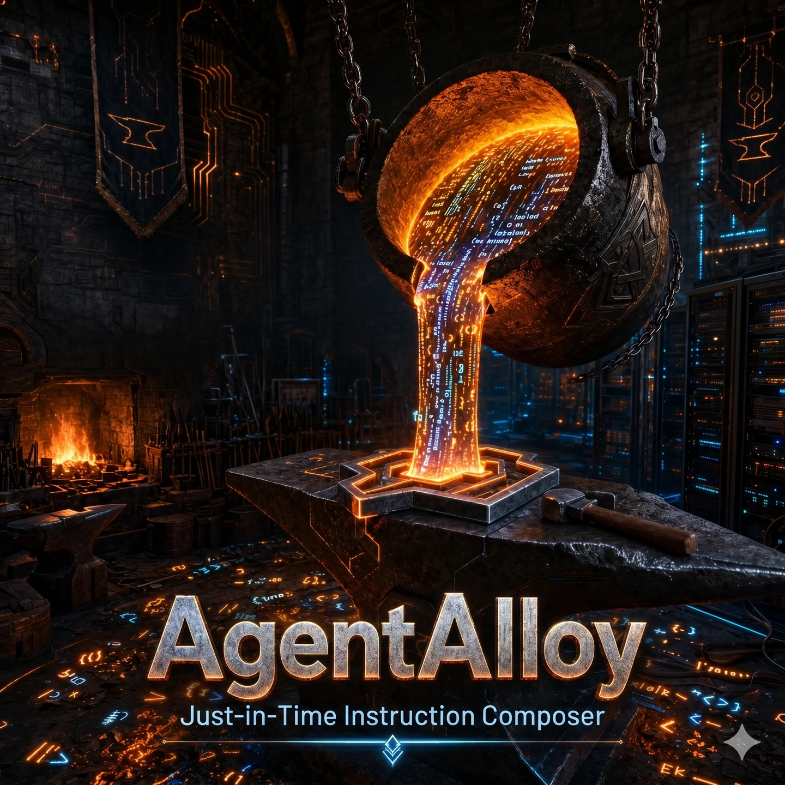

<p align="center">
  
</p>

<p align="center">
  <b>Fuse your base model with the exact governance, workflows, and skills it needs — right now.</b>
</p>

<p align="center">
  <a href="LICENSE"></a>
  &nbsp;
  
  &nbsp;
  <a href="https://github.com/astral-sh/uv"></a>
  &nbsp;
  
  &nbsp;
  
  &nbsp;
  
</p>

`AGENTS.md`, `SKILL.md`, and giant static system prompts were a clever first attempt — and they're already breaking. They load once at session start, then rot as the conversation drifts from the script; reloading them every turn just trades drift for token waste. The real problem is structural: over a single session the rules and skills your agent needs change dozens of times, and static files can't keep up. Leave them out and a smaller model flounders on tasks its training never covered; cram them all in and you pay the token tax every turn — or pay it again redoing the work it got wrong.

**AgentAlloy** is a **just-in-time instruction composer**. A signal layer — a small local embed model (`nomic-embed-text-v1.5`, served by llama-server) plus deterministic Python — wakes only when your agent's situation shifts: a phase transition, a new task contract, a meaningful file change. Nothing changed means nothing injected — your agent works uninterrupted. When something *has* changed, AgentAlloy composes a fresh, highly targeted pre-prompt, fusing three instruction sets into the exact persona the moment calls for:

- **System Governance** — hard boundaries and operational rules (Linear issue naming, PR branch conventions, CI/deployment gates).
- **Workflow Directives** — process constraints (Spec-Driven Development rules, defining success criteria without solution wording).
- **Domain Skills** — a focused slice of a curated 300+ skill corpus (languages, testing frameworks, discovery techniques) retrieved via hybrid BM25 + dense scoring.

This gives smaller models the leverage to punch above their weight class, and gives larger models a runtime reminder of how they should be operating — both of which mean getting it right the first time, not the third.

Phase-aware, intent-aware, and fully local — no remote calls, and zero paid-LLM tokens spent on routing. The composition path is **deterministic by default**: its one optional LM stage — a local fragment re-ranker that only reorders candidates and fails open — ships **off by default** as of v5.0.0 — it only reorders candidates, showed no lift on the eval set, and added ~500 ms/compose, so it's disabled out-of-box (re-enable with `LM_ASSIST=arbitrate`); it always degrades cleanly to deterministic selection. The signals layer's phase-gate classifier *does* default to a small local reranker — a measured win over cosine — falling open to cosine whenever no reranker server is running. Nothing leaves your machine: the whole loop runs on one small embed model (`nomic-embed-text-v1.5`) plus a 0.6B reranker for the intent gates, over an embedded LanceDB vector store + DuckDB. Want it containerized? `agentalloy setup --deployment container` ships the same stack as a single container.

Things your agent gets composed-and-injected without you pasting them into the prompt:

- "How do I write a failing pytest before the implementation?" — TDD workflow + framework idioms, composed from `pytest` + `testing` packs.
- "How do I structure an incremental dbt model so it stays correct across re-runs?" — data-engineering governance + domain skills, composed from `data-engineering` + `engineering` packs.
- "Wire OpenTelemetry into this FastAPI app." — observability rules + framework patterns, composed from `fastapi` + `analytics` packs.
- "I'm reviewing this PR — what should I check?" — review heuristics, composed from `code-review` packs.

**This is what zero-shot agentic development looks like.**

---

## Contents

- [Getting started](#getting-started)
- [Demo](#demo)
- [What makes the composition different](#what-makes-the-composition-different)
- [How it works: phases, contracts, signal layer](#how-it-works-phases-contracts-signal-layer)
- [How to use it](#how-to-use-it)
- [Container deployment](#container-deployment)
- [Profiles](#profiles-user-scoped-skill-contexts)
- [Harness support](#harness-support)
- [Standalone CLI](#standalone-cli)
- [REST API](#rest-api)
- [MCP Server](#mcp-server)
- [Packs shipping in-tree](#packs-shipping-in-tree)
- [Architecture](#architecture)
- [Telemetry](#telemetry)
- [Web UI](#web-ui)
- [Configuration](#configuration)
- [Development](#development)
- [Need Help?](#need-help)
- [Contributing](#contributing)
- [Benchmarks](#benchmarks)
- [License](#license)

---

## Getting started

Two doors — pick the one that's you:

### New to AgentAlloy

Install the CLI once, then run the wizard:

```bash
# 1. install uv (Linux / macOS)
curl -LsSf https://astral.sh/uv/install.sh | sh

# 2. install the agentalloy CLI
uv tool install git+https://github.com/nrmeyers/agentalloy.git

# 3. run the setup wizard
agentalloy setup

# 4. wire your repo to the harness (per-repo — repeat in each project)
cd /path/to/your/repo
agentalloy wire --harness claude-code
```

The wizard detects your hardware, downloads the GGUF models, starts the embed + reranker servers, lets you pick skill packs, wires your IDE harness, and validates the result — **3–5 minutes** on a warm machine. Wiring is **per-repo**: the wizard wires the repo you run it in, so run step 4 in every other project you want composed. Its first question is **how to deploy**; both choices run the same wizard:

- **Container** *(recommended for new installs, default)* — agentalloy + two bundled `llama-server` instances in one image pulled from GHCR (`ghcr.io/nrmeyers/agentalloy:latest`). Zero host dependencies, air-gapped friendly, **CPU-only on every host**. Ships a prebuilt corpus, so first run only waits on the model download; port 47950 is the only external surface. Requires a container runtime — Docker or Podman — that is both **installed and running** (a `podman` CLI on PATH with no started `podman machine`, or a stopped Docker Desktop, does not count). If no usable runtime is found, setup tells you to install one and re-run, or — interactively — offers to switch to a Native install on the spot.
- **Native** — runs the models directly on your host via llama-server with GPU acceleration (NVIDIA CUDA / AMD ROCm / Apple Metal, or CPU if you have no GPU). Fastest composition path, full control.

> **Already using Ollama?** AgentAlloy runs on `llama-server`, not Ollama. You can still point `RUNTIME_EMBED_BASE_URL` at any OpenAI-compatible 768-dim `nomic-embed-text-v1.5` endpoint you already run.

For the full step-by-step runbook (and air-gapped installs), see **[INSTALL.md](INSTALL.md)**. Just want to see it work first? [Run the demo](#demo).

#### Scripted / non-interactive

Skip the wizard with flags:

```bash
# native
agentalloy setup -n --hardware nvidia --packs all --harness claude-code
# container (auto-detects the runtime; podman preferred when both work)
agentalloy setup -n --deployment container --harness claude-code
# container, pinning the runtime non-interactively
agentalloy setup -n --deployment container --runtime docker --harness claude-code
# sidecar harnesses (cursor, windsurf, github-copilot, gemini-cli) also need --acknowledge-sidecar:
agentalloy setup -n --hardware nvidia --packs all --harness cursor --acknowledge-sidecar
```

For a proxy-wired harness, point it at your upstream LLM with `--upstream-url` / `--upstream-model` / `--upstream-api-key` (or the matching env vars — preferred for the key, which is otherwise visible in process args).

### Already running AgentAlloy

Move to the latest release in one command — it detects your deployment, swaps the package (native) or image (container), refreshes the corpus only if it changed, restarts, and verifies:

```bash
agentalloy upgrade            # native or container — auto-detected
agentalloy upgrade --check    # report current vs latest, change nothing
agentalloy upgrade --dismiss  # silence the new-release nudge until a newer one lands
agentalloy --version          # what you're on now
```

You don't have to remember to check: the running service polls GitHub for a newer release at most once a day (its only outbound call, fail-silent, opt out with `AGENTALLOY_RELEASE_CHECK=0`) and surfaces a glanceable nudge — an `↑` with the new version — on the status line, in `agentalloy status`, and at server-start.

When you run `agentalloy upgrade`, a **preflight** shows the release title, notes link, and version bump (patch/minor/major) — plus a heads-up if you have customized skills that will be re-validated — then asks you to confirm before anything is swapped. Native installs re-install from the newest tagged release; container installs pull the matching image and recreate (the corpus self-heals from the image's prebuilt seed). A major-version embedding change triggers a one-time re-embed — you're prompted for that too (`--yes` to auto-confirm both prompts, `--ref vX.Y.Z` to pin a specific release).

### Runtime toggles (set by what they measured)

Independent of deployment, composition is **deterministic by default**. Three runtime levers — env vars in `~/.config/agentalloy/.env`, not wizard prompts — tune how much optional assistance is in the loop. Each default is the one the benchmarks earned (see [BENCHMARKS.md](BENCHMARKS.md)); the model-backed ones fail open to the deterministic path when their model is unavailable:

- **`SIGNAL_INTENT_BACKEND` — default `reranker` (on).** Detects phase-transition intent from natural language — *"looks right, now the design"* advances `spec → design` with no rigid keyword. As of v2.4.0 this is the **primary phase-transition trigger** (the reranker beats cosine on intent: per-intent macro-F1 0.24 → 0.69). It needs a `llama-server` running `Qwen3-Reranker-0.6B-Q8_0.gguf` (default `127.0.0.1:47952`) — **the setup wizard provisions and starts one for you**. If that server is down, the gates fall open to the cosine floor (functional, less precise); set `SIGNAL_INTENT_BACKEND=cosine` to opt out explicitly. `agentalloy verify` and `agentalloy doctor` report whether it's live.
- **`LM_ASSIST` — `off` on every preset (v5.0.0).** The composition fragment re-ranker. Shipped disabled: it showed no lift on the eval set and adds ~500 ms/compose (v4.0.2 had enabled it for n=2 / real-life skill-ranking; off for now pending a cleaner fix). Re-enable with `LM_ASSIST=arbitrate` — when enabled, hardware-appropriate slot config is selected automatically by the launcher (`rerank_launch_args`): GPU runs `--parallel 2 -c 4096` (Pareto sweet spot — ~94% of `--parallel 8` throughput at half the KV memory), CPU runs `--parallel 1 -c 2048` (single slot, all threads to one inference — avoids OpenMP contention that hurts CPU throughput with multiple slots). Measured warm latency: GPU K=8 batch ~485ms, CPU K=8 batch ~1170ms; both fit the 2000ms `LM_ASSIST_TIMEOUT_MS` budget. Stage B always fails open to deterministic selection if the reranker is unavailable.
- **`RETRIEVAL_GRAPH_EXPAND` — default `off`.** Deterministic skill-graph edge expansion (`=on` to enable). Off by default because it showed **no measured lift**.

See [docs/lm-assist-design.md](docs/lm-assist-design.md) for the design and [docs/operator.md](docs/operator.md) for the config reference.

---

## Demo

```bash
$ curl -s -X POST http://localhost:47950/compose \
    -H 'Content-Type: application/json' \
    -d '{"task": "write a failing pytest", "phase": "build"}' | jq .

{
  "output": "## TDD: write the failing test first\n\nIn pytest, ...",
  "source_skills": ["test-driven-development", "pytest-fixtures"],
  "system_skills_applied": true,
  "assembly_tier": 0,
  "recommended_max_tokens": 2048,
  "dense_leg_degraded": false,
  "latency_ms": { "retrieval_ms": 31, "assembly_ms": 16, "total_ms": 47 }
}
```

Your agent calls `/compose`, gets back the relevant raw skill prose, and assembles it inside its own prompt. No paid LLM in the loop, no token tax, no API key roulette. Sub-50ms p95 on a warm cache.

---

## Container deployment

AgentAlloy can run as a single container (setup option #1, the default) that bundles the service and its inference runners — two `llama-server` instances (embed + reranker), with the llama.cpp toolchain copied from `ghcr.io/ggml-org/llama.cpp:full` — the recommended deployment when you want zero host-side inference dependencies. The image is pulled from GHCR (`ghcr.io/nrmeyers/agentalloy:latest`); the full container runbook lives in [INSTALL.md](INSTALL.md).

The setup wizard:

1. **Detects** a usable container runtime — installed *and* running (detection runs `<runtime> info`, not just a PATH check). `podman` is preferred, `docker` is the fallback; when both work you're prompted to choose (or pass `--runtime {podman,docker}`). If none is usable, setup stops with install instructions, or offers to switch to Native interactively.
2. **Pulls** the pre-built image from GHCR (`ghcr.io/nrmeyers/agentalloy:latest`).
3. **Creates** a named volume `agentalloy-data` for persistent corpus data.
4. **Runs** the container with volume mounts, env vars, and port mapping.
5. **Waits** for the readiness endpoint (`/readiness`) to respond.

### Container architecture

```
┌──────────────────────────────────────────────────┐
│  agentalloy:latest (podman run --replace)        │
│                                                  │
│  /app/entrypoint.sh (bash)                       │
│  ├── Check .bootstrap-complete (skip if done)    │
│  ├── Seed prebuilt corpus (published images)     │
│  ├── Download GGUFs into /app/data/models        │
│  │     (embed + reranker, if missing)            │
│  ├── Start embed llama-server (--embeddings :47951)│
│  ├── Start reranker llama-server (:47952)         │
│  ├── Run migrations                              │
│  ├── install-packs (skipped when seeded)         │
│  ├── Touch .bootstrap-complete                   │
│  ├── exec uvicorn (main service, :47950)         │
│                                                  │
│  ENV: AGENTALLOY_PACKS, FRAGMENTS_LANCE_PATH          │
│      DUCKDB_PATH, LOG_LEVEL                       │
└───────────┬──────────────────────────────────────┘
            │ -p 47950:47950
            ▼
   localhost:47950  (external)

Volume mount:
  agentalloy-data → /app/data  (corpus, database, GGUFs under /models)
```

### Volume layout & bootstrap

The entrypoint (`/app/entrypoint.sh`, baked into the image) seeds the prebuilt
corpus, downloads both GGUFs (`nomic-embed-text-v1.5.Q8_0.gguf` +
`Qwen3-Reranker-0.6B-Q8_0.gguf`) into `/app/data/models`, starts the two
`llama-server` daemons (embed on 47951, reranker on 47952), runs migrations, and
execs uvicorn — idempotent across restarts via a `.bootstrap-complete` marker. A
single volume persists: `agentalloy-data:/app/data` (corpus + databases + the
downloaded GGUFs under `/app/data/models`). The full bootstrap sequence and
operational command reference live in [INSTALL.md](INSTALL.md) and
[docs/operator.md](docs/operator.md).

### Hardware requirements

Container deployment is **CPU-only** on every host; GPU acceleration (NVIDIA CUDA, AMD ROCm, Apple Metal) requires a native install. The bundled `llama-server` instances run `nomic-embed-text-v1.5.Q8_0.gguf` and `Qwen3-Reranker-0.6B-Q8_0.gguf` on CPU — fast enough for the runtime path (short-text embeds and intent reranking); only corpus-wide work such as a full reembed runs meaningfully slower than on GPU.

| Requirement | Minimum |
|---|---|
| RAM | 8 GB |
| Disk (image + model + data) | ~4 GB |
| Container runtime | Podman (recommended) or Docker |

---

## What makes the composition different

- **Composed per task, not loaded every turn.** A skill that's irrelevant to the current task isn't in the prompt at all — RRF + applicability filtering picks the right subset for each request.
- **Three instruction sets, fused.** Governance, workflow, and domain skills are composed together into one persona — not three files the agent has to reconcile on its own.
- **Phase-aware.** Phase sets the candidate budget (`k`) and the dense-vs-lexical fusion weights — QA biases lexical, spec biases dense — so the same task composes differently across the lifecycle. Retrieval itself is phase-agnostic: there's no hard phase→category gate.
- **Hybrid retrieval, not lexical-only.** Token-literal queries (`"JWT"`, `"Prisma"`) hit BM25; semantic queries ("the auth handler") hit a 768-dim dense leg. Phase-tuned Reciprocal Rank Fusion picks the better signal per query.
- **No model variance by default.** Embeddings + lexical match + deterministic fusion mean the same task → same composition, regardless of which agent model you swap in tomorrow. (The optional composition fragment re-ranker is the only non-deterministic element in this path — off by default, fail-open.)
- **Versioned & validated.** Every skill is sourced from authoritative upstream docs and validated against the R1–R8 quality contract (`src/agentalloy/_packs/meta/sys-skill-authoring-rules.md`).

---

## How it works: phases, contracts, signal layer

<details><summary>Click to expand — deep dive into the signal layer internals</summary>

Three small artifacts on disk drive everything AgentAlloy does. None of them belong to your agent's prompt — they're state files that the signal layer reads.

### 1. The phase file

```
.agentalloy/phase       →  phase: build
```

A sticky, one-line YAML file under your project. Tracks where the agent is in the SDD lifecycle: `intake → spec → design → build → qa → ship`. Small, low-risk tasks can take the **fast lane** — at intake the agent routes to `sdd-fast`, a single compressed spec-design-build phase, giving `intake → sdd-fast → qa → ship`. Requests that are about *teaching the corpus* rather than changing code ("add a skill for our deploy process") take the **add-skill lane** (`intake → add-skill → intake`): guided custom-skill authoring — draft, R1–R9 self-critique, scaffold into `.agentalloy/custom-skills/`, strict `validate-pack` — ending in a human-approved `install-pack`, after which the session returns to intake. Each phase has a corresponding **workflow skill** (e.g., `sdd-build`) that ships persona prose and a set of declarative **exit gates**. When the agent enters a phase, that workflow skill's prose is injected as the persona for the duration; when the exit gates pass, the phase advances and the next workflow skill takes over.

The lifecycle is per-repo and opt-out. Set the mode with `agentalloy wire --lifecycle-mode {full,off}` (stored in `.agentalloy/config`): `full` (default) runs the intake front-door and the full phase lifecycle; `off` stays wired but composes nothing. When wiring detects a repo that already defines its own `.claude/agents/` or `.claude/commands/`, it prompts for the mode (interactive only; non-interactive defaults to `full`).

On the **full lane**, two transitions are gated by an explicit human-in-the-loop approval marker: `spec → design` and `design → build`. Run `agentalloy approve <phase>` after reviewing the spec / design artifacts; the marker pins to the artifact's `sha256` so a post-approval edit invalidates it. `--force` does **not** bypass approval (it only carves out the artifact-completeness gates). The **fast lane** keeps `phase set qa` as the forward verb without an approval marker; set `SDD_FAST_REQUIRE_APPROVAL=on` in `.env` to opt in. The **add-skill lane** is always approval-gated — `agentalloy approve add-skill` is the only way forward and no setting disables it, because installing a skill changes what gets composed into every future session in that repo. Build contracts must also carry **≤2 `domain_tags`** (one dominant tech surface) — multi-surface contracts block `design → build` until split, bypassable by `--force`. See [docs/operator.md](docs/operator.md) for the full gate inventory.

### 2. Task contracts

```
.agentalloy/contracts/build/add-auth-middleware.md
```

A short markdown file the agent writes when starting a task. The frontmatter declares intent:

```yaml
---
phase: build
task_slug: add-auth-middleware
domain_tags: ["NestJS", "Express middleware", "JWT validation"]
scope:
  touches: ["src/auth/**", "tests/auth/**"]
  avoids:  ["src/billing/**"]
success_criteria:
  - "Existing auth tests still pass"
  - "Middleware tested with valid + invalid tokens"
---

# Add Auth Middleware
<one paragraph of task prose>
```

The agent writes the contract once at task start. From then on, **`domain_tags` is the BM25 input for retrieval** — surgical, intent-aware, and stable across the conversation. No prompt engineering required; the agent just records what it's about to do.

### 3. The signal layer

A small Python module that wakes on three kinds of events: a user prompt arrives, a contract file is written, a tool is about to fire. It runs a cheap **pre-filter** (signal keywords, file-event scope checks) to decide if anything needs to happen. If nothing matches, it returns silently — no tokens spent, no injection. If something matches, it evaluates the active phase's **exit gates** (deterministic predicates like `artifact_exists`, `git_state`, `contract_has_tags`, plus a few semantic ones that cosine-similarity-score the prompt against named intents using the same embed server). When gates pass, the phase file is updated atomically and the next workflow skill's prose is emitted as pre-prompt context.

```
        ┌───────────────────┐
        │  prompt / event   │
        └─────────┬─────────┘
                  ▼
        ┌───────────────────┐
        │   pre-filter      │ ── no match ──► silent exit
        │   (cheap)         │
        └─────────┬─────────┘
                  ▼ match
        ┌───────────────────┐
        │  evaluate gates   │
        │  (deterministic + │
        │   reranker)       │
        └─────────┬─────────┘
                  ▼
   ┌──────────────┴──────────────┐
   │                             │
   ▼                             ▼
phase transition          system skill fires
  → next workflow            (commit-safety,
    skill injected            secret-handling,
                              etc.)
```

Phase-gate evaluation is deterministic predicates plus a named-intent classifier; that classifier defaults to a small local reranker (measured better than cosine) and fails open to deterministic cosine scoring when no reranker server is running. Zero paid-LLM tokens spent on "where am I?", "what should I be doing?", or "should I call AgentAlloy now?"

</details>

---

## How to use it

Three paths, depending on how your harness integrates with external tools.

### Standalone HTTP service

Run AgentAlloy on its own port; your agent (or your script, or your CI) calls `POST /compose` and reads the response. Zero coupling to a specific harness — works with anything that can hit an HTTP endpoint.

```bash
python -m agentalloy                  # default :47950
curl -s http://localhost:47950/health # {"status":"healthy", "dependencies": {...}}
```

### Wired into a proxy-wired harness (full integration)

If your harness honors a custom API base URL (OpenAI / Anthropic / a config-file `apiBase`), AgentAlloy points it at the local proxy. Every LLM request flows through the proxy, which injects skill context, evaluates gates, and forwards to the real upstream. Phase transitions, contract retrieval, and system skill enforcement all happen automatically.

```bash
agentalloy wire --harness <name>
```

**Claude Code is auth-transparent.** Wiring writes a per-repo `.agentalloy/claude-code-env.sh` that exports **only** `ANTHROPIC_BASE_URL=http://localhost:47950/proj/<token>` — never an API key. The `/proj/<token>` segment is `base64url(realpath)` of the repo, so the proxy resolves this repo's phase and lifecycle straight from the URL (no shared state). Because no key is set, Claude Code attaches your **own** credential and the proxy forwards it verbatim — account/OAuth auth (Pro/Max/Team, who have no API key) keeps working unchanged. The env file is sourced via direnv if a `.envrc` is present, otherwise `wire` prints a one-line `source` hint.

### Parallel sessions with git worktrees

Run several agent sessions against the same repo at once — each on its own branch, each at its own phase — with one command:

```bash
agentalloy worktree <harness> <branch> -b   # create the worktree + wire it in one shot
cd ../<branch>                              # then start your session there
```

Isolation is automatic and needs no new server. The proxy keys per-repo state on `base64url(realpath)` of the working directory, so a worktree's distinct path gets its own `/proj/<token>` — and therefore its own `.agentalloy/` phase and upstream, git-excluded so they never get committed. All worktrees share the one running service and the one user-scoped corpus; concurrent inference is read-only against that corpus, so sessions never contend.

The one caveat: corpus *mutations* (`agentalloy install-packs`, `agentalloy reembed`) take the single-writer lock and affect every worktree, so stop the service before running them. Day-to-day composition does not.

### Wired into a sidecar harness

A few harnesses (Cursor, Windsurf, GitHub Copilot, Gemini CLI) route through their own backends and can't be intercepted. For those, AgentAlloy writes a static rules file and a file-watching sidecar regenerates that file within ~1s of a phase or contract change. You start the sidecar once per session:

```bash
agentalloy wire --harness <name>
agentalloy watch start --harness <name>
```

The capability matrix and a fuller picture live in [Harness support](#harness-support) below.

---

## Profiles: user-scoped skill contexts

Profiles let you maintain separate skill contexts for different kinds of work — e.g., a `work` profile with stricter CI gates and team governance rules, a `personal` profile with relaxed constraints and hobby-project domain skills. Profiles auto-resolve per-repo based on git remote URL, filesystem path, or an explicit project marker, so you never need to switch them manually.

This is the key difference from `AGENTS.md` / `SKILL.md` approaches:

- **AgentAlloy install is one-time and user-scoped.** A single install serves all your projects. State lives under `~/.config/agentalloy/` and data under `~/.local/share/agentalloy/`.
- **Profiles determine skill overrides per-repo.** Configure once, and the active profile resolves automatically when you `cd` between projects.
- **Wiring is still per-repo.** Each project needs `agentalloy wire` to inject sentinels into its harness config files (`.cursor/rules/`, `.clinerules`, etc.), but the skills those sentinels reference come from the user-scoped profile.

See [profiles-and-overrides.md](docs/profiles-and-overrides.md) for full details.

---

## Harness support

Harnesses fall into two categories:

- **Proxy-wired** (Claude Code, Continue.dev, Aider, Cline, Codex, OpenClaw, OpenCode, Hermes Agent) — full per-turn integration via the local proxy. The proxy intercepts LLM traffic, injects skill context, and evaluates gates automatically.
- **Sidecar** (Cursor, Windsurf, GitHub Copilot, Gemini CLI) — static rules file kept current by a file watcher. Reduced capability: no enforcement, advisory text only.

Proxy-wired is the preferred mode. Full per-harness catalog: [docs/install/harness-catalog.md](docs/install/harness-catalog.md).

---

## Standalone CLI

The `agentalloy` CLI handles install, service management, phase control, and composition. Key commands:

```bash
agentalloy setup                          # Interactive install wizard
agentalloy wire --harness <name>          # Wire a harness (--lifecycle-mode full|off, --clean-room)
agentalloy unwire [--harness <name>]      # Remove wiring (one harness in this repo; --all for every repo)
agentalloy add <harness>                  # Adopt a harness's own upstream + wire it through the proxy (per-repo)
agentalloy worktree <harness> <branch> -b # Create a git worktree + wire it (parallel agent sessions)
agentalloy serve                          # Run the service
agentalloy phase [set|clear]              # Bare prints current phase; set/clear to change
agentalloy compose --contract <path>      # One-shot composition
agentalloy approve <phase>                # Record the human-in-the-loop approval marker (spec | design)
agentalloy customize <list|edit|diff|reset>  # Manage per-profile / per-project skill overrides
agentalloy doctor                         # Diagnose install issues
agentalloy upgrade                        # Upgrade to the latest release (--check to preview, --dismiss to mute the nudge)
agentalloy cleanup                        # Reap orphaned runtimes; --deep fully sanitizes the host
agentalloy rerank-warmup                  # Warm the reranker (wired into the systemd unit's ExecStartPost)
agentalloy --version                      # Print the installed version
```

Full command reference: [docs/operator.md](docs/operator.md).

Each subcommand emits structured JSON on stdout; pair with `jq` for scripting.

---

## REST API

AgentAlloy serves both OpenAI-compatible and Anthropic Messages API endpoints through the proxy:

- `POST /proj/{token}/v1/messages` — native Anthropic passthrough (Claude Code); auth-transparent, per-repo `{token}` discriminator, no translation
- `POST /v1/chat/completions` — OpenAI-compatible proxy
- `POST /compose` — Manual skill composition
- `GET /health` — Liveness probe

See [proxy-architecture.md](docs/proxy-architecture.md) for the full endpoint list and request/response schemas.

---

## MCP Server

AgentAlloy ships a built-in MCP server for harnesses that support the Model Context Protocol. Instead of proxying LLM traffic, the MCP server exposes a single tool the harness calls on demand:

- **`get_skill_for(task, phase)`** — forwards to the local `/compose` endpoint and returns composed skill fragments.

The server is dependency-free (no MCP SDK) and runs via stdio JSON-RPC (MCP 2024-11-05 spec).

```bash
# Wire with MCP fallback instead of proxy:
agentalloy wire-harness --harness cursor --mcp-fallback
```

Supported harnesses: Claude Code, Cursor, Continue.dev. See [Harness Catalog § MCP Fallback](docs/install/harness-catalog.md) for per-harness configuration details.

---

## Packs shipping in-tree

The corpus is **packs** — opt-in groups of related skills. `main` ships **38+ packs / 320+ declared skills** organized across 9 tiers:

<table>
<tr><th>Tier</th><th>Packs</th></tr>
<tr><td><b>foundation</b></td><td><code>core</code> · <code>documentation</code> · <code>engineering</code> · <code>performance</code> · <code>refactoring</code></td></tr>
<tr><td><b>language</b></td><td><code>csharp-dotnet</code> · <code>go</code> · <code>java</code> · <code>nodejs</code> · <code>python</code> · <code>rust</code> · <code>typescript</code></td></tr>
<tr><td><b>framework</b></td><td><code>fastapi</code> · <code>fastify</code> · <code>nestjs</code> · <code>nextjs</code> · <code>react</code> · <code>vue</code></td></tr>
<tr><td><b>tooling</b></td><td><code>linting</code> · <code>pytest</code> · <code>testing</code> · <code>vite</code> · <code>vitest</code></td></tr>
<tr><td><b>workflow</b></td><td><code>code-review</code> · <code>design-review</code> · <code>intake</code> · <code>sdd</code></td></tr>
<tr><td><b>domain</b></td><td><code>analytics</code> · <code>calendar-ui</code> · <code>data-engineering</code> · <code>ui-design</code></td></tr>
<tr><td><b>platform</b></td><td><code>github-actions</code></td></tr>
<tr><td><b>protocol</b></td><td><code>rest</code> · <code>webhooks</code></td></tr>
<tr><td><b>store</b></td><td><code>redis</code> · <code>redshift</code> · <code>snowflake</code> · <code>temporal</code></td></tr>
</table>

Every skill is sourced from authoritative upstream docs and validated against the **R1–R8 quality contract** (`src/agentalloy/_packs/meta/sys-skill-authoring-rules.md`) via a local-first author-critic pipeline (currently being redesigned). Nothing about authoring is required to *use* AgentAlloy at runtime.

---

## Architecture

AgentAlloy is a three-layer system:

1. **Signal layer** — deterministic Python that wakes on phase transitions, contract writes, or tool fires. Pre-filters cheaply, evaluates exit gates, and composes skills only when needed.
2. **Composition engine** — hybrid BM25 + dense retrieval over DuckDB (skill graph) and LanceDB (vector + BM25 index), fused via phase-tuned Reciprocal Rank Fusion.
3. **Proxy** — OpenAI-compatible and Anthropic Messages API endpoints that intercept harness traffic, inject composed skills, and forward to the upstream LLM.

Both runtime paths are **deterministic by default** — the only optional LM stages (the composition re-ranker and the signal-layer intent reranker) fail safe to deterministic scoring. See [docs/proxy-architecture.md](docs/proxy-architecture.md) for the full design.

---

## Telemetry

Every `/compose`, `/retrieve`, and signal evaluation writes a structured trace to DuckDB before the response returns — no async backlog, no dropped traces. Trace-write failures never propagate.

Query via `GET /telemetry/traces` (filterable by phase, status, time window, and repo), `GET /telemetry/savings` (token-savings aggregation), and `GET /telemetry/coverage` (composed vs passthrough rate per phase and repo) — or browse all three interactively in the [web UI](#web-ui). The CLI exposes `agentalloy telemetry savings` and `agentalloy telemetry clear` (truncates `composition_traces`). See [docs/operator.md](docs/operator.md) for the full trace schema and filter options.

---

## Web UI

The service ships a browser dashboard served from the same FastAPI process at [http://localhost:47950/](http://localhost:47950/) — no extra daemon, localhost-only, no auth. Pages:

- **Config** — edit the user-scoped `.env` with field validation and masked secrets; soft-reload without a restart.
- **Telemetry** — trace explorer with the full signal story per request (gates met/unmet, pre-filter, Stage A/B rerank outcomes), token-savings charts, and composed-vs-passthrough coverage.
- **Skills** — browse the corpus with pack provenance and override badges, inspect full version history, and customize system/workflow prose in a one-click editor with a live `prose_invariants` checklist and a diff against the shipped default (replaces the `customize edit → validate → update` loop).
- **Playground** — ranked retrieval with scores, compose preview with a `debug=true` per-stage explain mode, and a read-only signal simulator ("would this prompt compose right now?").
- **Repos & Approvals** — every wired repo's phase, gate blockers, and per-repo upstream; an actionable approval queue for `spec`/`design`/`add-skill` sign-offs (approving records the marker and auto-advances the phase; editing an artifact after sign-off resurfaces it as stale).
- **Ops** — doctor checks, reembed status and runs, pack install state, profile resolution.
- **New Skill** — a four-step wizard on the same rails as the add-skill lane: scaffold → draft (with an R1–R9 self-check panel) → strict validate → approve + install.

Build it once with `cd frontend && pnpm install && pnpm build`; the service serves `frontend/dist` automatically from then on. Without a build the API is unaffected and `/` answers 501 with instructions. Mutating endpoints require the `X-AgentAlloy-CSRF: 1` header (the UI sends it; with no CORS grant on the localhost-only service, foreign origins can't). Design: [docs/web-ui-and-add-skill-combined-spec.md](docs/web-ui-and-add-skill-combined-spec.md).

---

## Configuration

Runtime environment variables are written automatically by `agentalloy write-env --preset <cpu|nvidia|radeon|apple-silicon>` to `~/.config/agentalloy/.env` (the preset matches your hardware; the files under `src/agentalloy/install/presets/` are the source of truth). Key variables:

- `UPSTREAM_URL` / `UPSTREAM_MODEL` / `UPSTREAM_API_KEY` — the global-fallback upstream LLM the proxy forwards to (a per-repo `agentalloy add` overrides these for that repo)
- `RUNTIME_EMBED_BASE_URL` — embedding endpoint (default: embed llama-server at `http://localhost:47951`)
- `RUNTIME_EMBEDDING_MODEL` — embedding model (default: `nomic-embed-text-v1.5.Q8_0.gguf`)
- `PROFILE_ROOT` — per-profile datastores
- `DEDUP_HARD_THRESHOLD` / `DEDUP_SOFT_THRESHOLD` — cosine dedup thresholds
- `BOUNCE_BUDGET` — compose retry budget

See [docs/operator.md](docs/operator.md) for the full configuration reference.

---

## Development

```bash
uv sync                          # install deps
uv run ruff check .              # lint
uv run ruff format --check .     # format
uv run pyright                   # types
uv run pytest                    # unit tests (fast)
uv run pytest -m integration     # integration — requires a running embed server (llama-server) with nomic-embed-text-v1.5.Q8_0.gguf
```

Tests live under `tests/` and cover the install pipeline (`tests/install/`), retrieval, composition, applicability filtering, telemetry, and the harness-wiring catalog.

---

## Need Help?

- [Installation guide](docs/install/) — step-by-step setup for each harness
- [Operator guide](docs/operator.md) — CLI reference, service management
- [Troubleshooting](docs/troubleshooting.md) — common errors and fixes
- [Discussions](https://github.com/nrmeyers/agentalloy/discussions) — ask questions, share setups

---

## Contributing

To contribute to the AgentAlloy codebase, use an editable install so your changes are reflected immediately:

```bash
git clone https://github.com/nrmeyers/agentalloy.git
cd agentalloy
uv sync
uv tool install --editable .
```

### Migrating from pipx

If you previously installed AgentAlloy via `pipx`, migrate to `uv`:

```bash
pipx uninstall agentalloy        # remove the legacy install
uv tool install git+https://github.com/nrmeyers/agentalloy.git
```

User-scope state (`~/.config/agentalloy/`, corpus DB) is preserved across the swap — pipx and uv installs share the same state location.

---

## Benchmarks

Measured on a 4-model × 3-condition matrix (composed / flat-oracle / no skills) over 18 pre-registered domain tasks (5 seeded runs per cell), with an independent 27B LLM-judge cross-check. Results that stand out:

- **On domain tasks, composed injection beat the bare model on every architecture (+0.02 to +0.17)**, capturing 51–71% of a hand-picked oracle's lift at 21–32% fewer tokens — automatic selection doing the job a human curator would.
- **The lift is biggest where it matters most: the LFM2.5 edge model gains +0.172**, and an independent 27B LLM-judge confirms it (+0.154, 95% CI excludes zero) — real answer quality, not a grader artifact.
- **Composed injection disciplines a small model.** On domain tasks the unguided baseline runs ~24% longer (2604 vs 1988 output tokens) and scores lower — focused skill prose makes the edge model both more correct *and* more concise.
- **Strong models sit near their ceiling** (35B +0.039, 27B +0.022): composition is the difference-maker for small models and a no-harm tie for large ones.

Full matrix, methodology, and caveats in [BENCHMARKS.md](BENCHMARKS.md).

---

## License

MIT. See [LICENSE](LICENSE).
